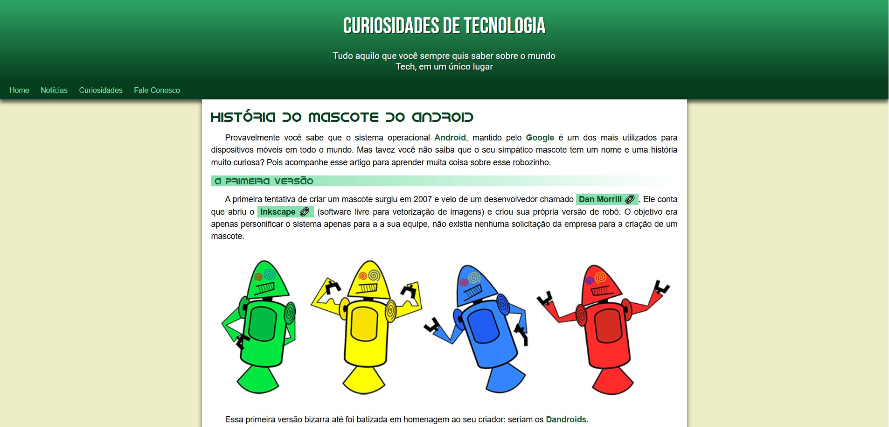

Curiosidades de Tecnologia — História do Mascote do Android

Este projeto é um site simples desenvolvido para fins de estudo, apresentando de forma leve e acessível a evolução do mascote do sistema operacional Android.

O conteúdo explica desde a primeira versão criada por Dan Morrill até o robô verde icônico que conhecemos hoje.

  

🎯 Objetivo do Projeto

Praticar HTML, CSS e conceitos básicos de estruturação de conteúdo.

Trabalhar com estilização, responsividade e navegação simples entre páginas.

Criar um layout limpo e agradável para leitura de artigos informativos.

🛠️ Tecnologias Utilizadas

HTML5

CSS3

📄 Conteúdo Apresentado

O site aborda:

A criação da primeira versão do mascote Android.

Curiosidades sobre os "Dandroids".

A evolução visual do mascote até o design oficial.

Informações adicionais em texto simples e ilustrado.

🚀 Como executar
Link na descrição do projeto
